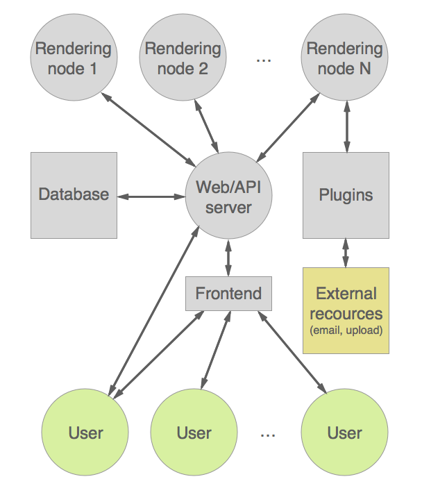

# Development
## Thoughts, ideas, plans
1. Use project format to store data as described in [project-format.js](project-format.js) as **Project**
2. Creating new instance of **Project** does not necessarily lead to rendering.
3. Created **Project** objects are stored in database.
4. **Projects** may be created (and stored) on separate machine
5. Structure of whole working "thing" looks like this:

## Description: 
1. Rendering node – any desktop with running instance of noxrender.renderer, including Web/API server. Must have Adobe After Effects installed.
2. Rendering nodes are not static, they can be added/deleted in any time. After laucning Rendering node sends api request to find any (or particular) **Project** to render.
3. Web/API server – any server/desktop with running instance of noxrender.api
4. Database is any Database (MongoDB, nedb, ...) that is storing created **Projects**
5. Users may create/access/modify **Project** via (optional) Frontend module, or via json REST API on webserver.
6. Plugins is an actions that are mostly launched after rendering process is over. They run on each Rendering node. 
7. Only one Rendering node can render same **Project**
